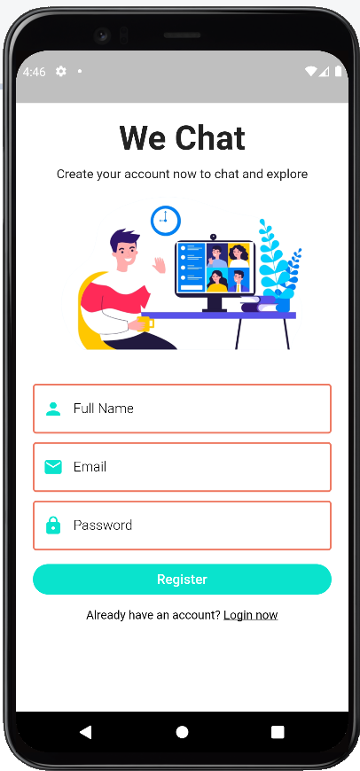
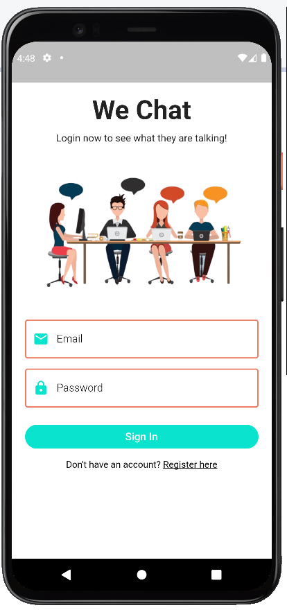
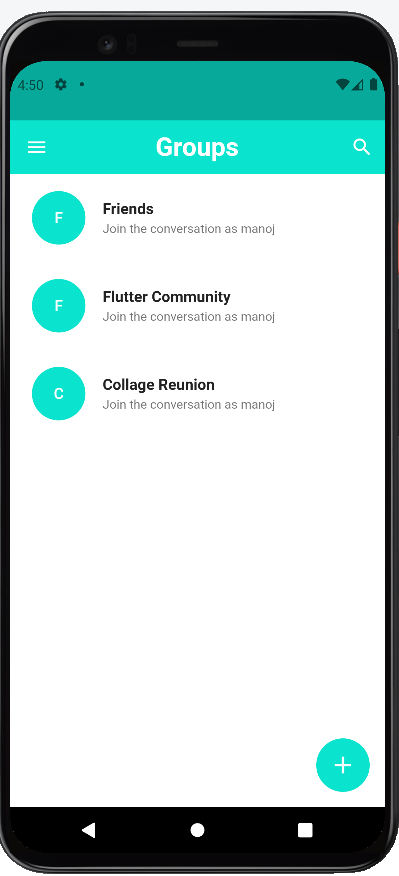
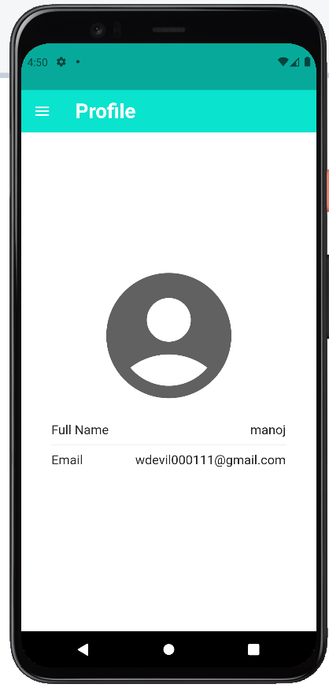
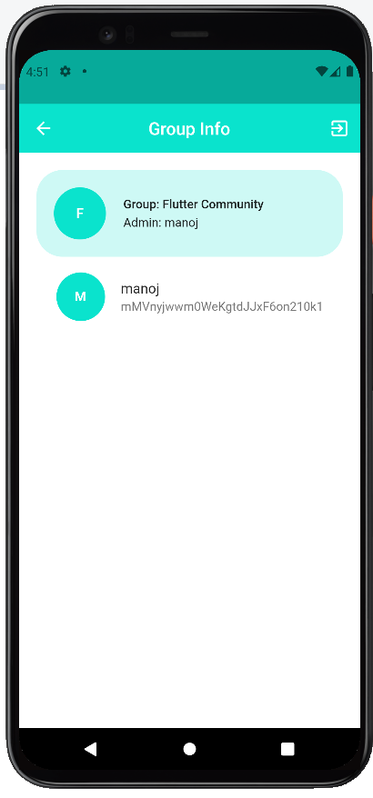
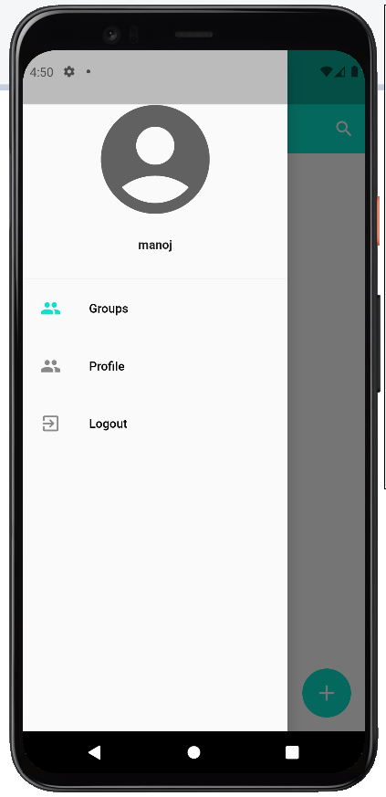
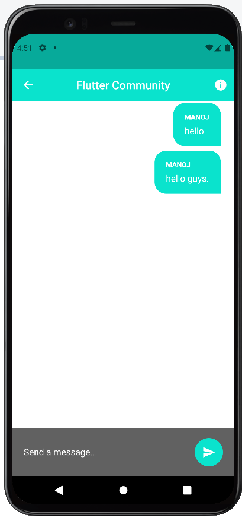
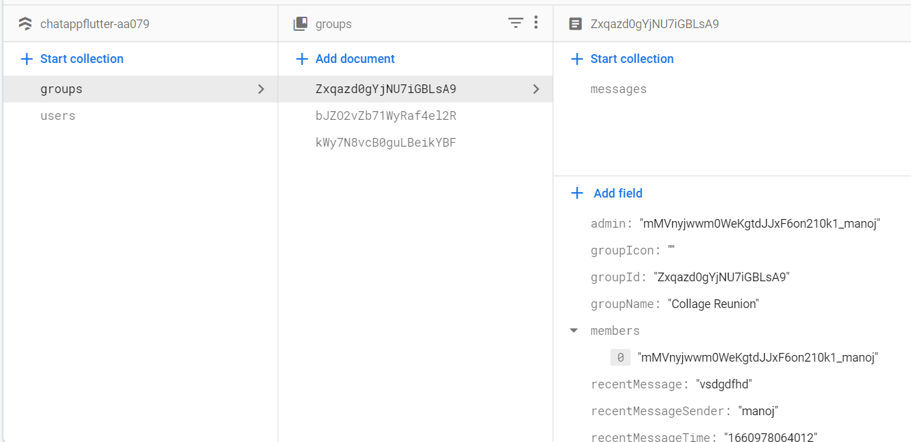

# Flutter We Chat App

 

# 💻Tech Stack Used

- Frontend - Flutter
- Database - Firebase

 

# ✨ Requirements

- Any Operating System (ie. MacOS X, Linux, Windows) with MySQL installed for the respective OS
- Any IDE with Flutter SDK installed (ie. Android Studio, VSCode, IntelliJ, etc)

 

# 📝Steps to run

 

1. Clone this repository, using `git clone https://github.com/nirala96/Food-Ordering-App.git`

2. open in Android studio and run `pub get`
3. Set up an android emulator or your android device and run.😊

 

# Screenshots

### ⚡ Login - Signup

 

    </img> </img> 

 
 

### ⚡ Home Page

 

    </img> 

 
 

### ⚡ Profile Screen

 

    </img> 

 
 

### ⚡ Group Info Page

 

    </img> </img> </img>

 -->

<!--  
  -->

### ⚡ Message Page

 
</img>
 
 

### ⚡ Database View

 
</img>
 
 

☕
